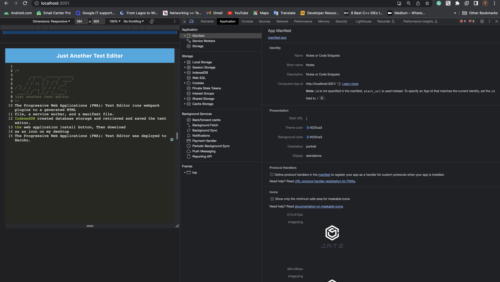
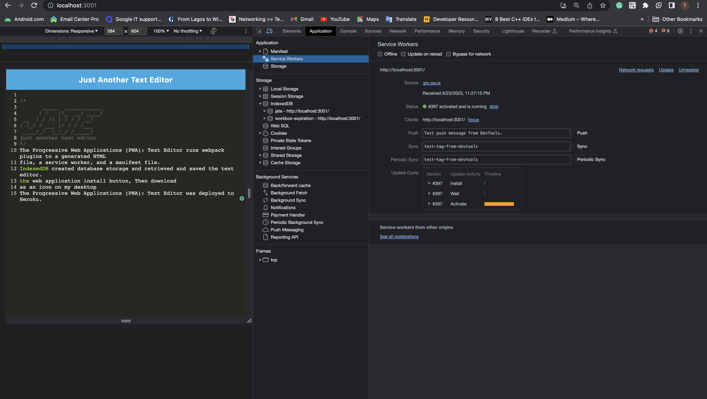
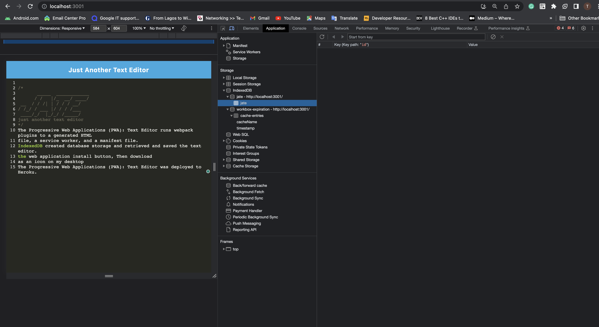
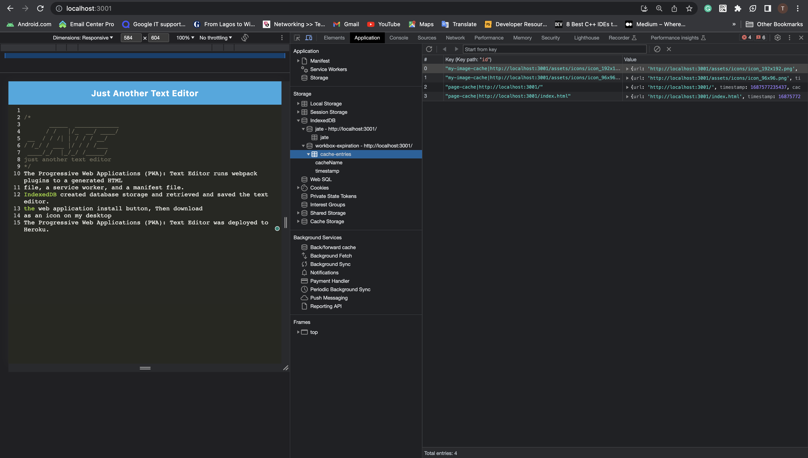

 # Project Name Text-Editor

 # Project Repository
 https://tessyj.github.io/Text-Editor/

# Project URL
https://github.com/TessyJ/Text-Editor

# Heroku URL
https://pwa-note-editor-861a86787a44.herokuapp.com/

# Project Description
The Progressive Web Applications (PWA): Text Editor runs webpack plugins to a generated HTML
file, a service worker, and a manifest file.
IndexedDB created database storage and retrieved and saved the text editor.
the web application install button, Then download
as an icon on my desktop
The Progressive Web Applications (PWA): Text Editor was deployed to Heroku.

# Screen Shot

[screenshot1](images/shot1.png)

